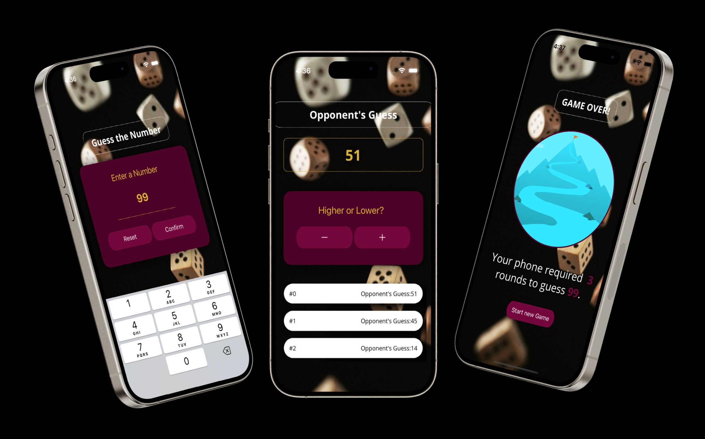

# MINI-GAME UDEMY ASSIGNMENT  🎮 🚀


# Overview
This project is a Mini-Game Application created as part of an assignment on Udemy. It is built with React Native using the Expo Bare Workflow. The project showcases event handling, optimized components, and basic game logic to provide an engaging user experience.

# Features
- Interactive Game Logic: Fun gameplay mechanics that keep users engaged.
- Responsive UI: Designed to work seamlessly across Android and iOS devices.
- Optimized Code: Focus on efficient and reusable components.
- Event Handling: Smooth handling of user interactions for an immersive experience.

# Technologies Used
- React Native: For building cross-platform applications.
- Expo Bare Workflow: Provides access to both Expo’s features and custom native code.
- JavaScript: Primary programming language for logic and UI.
- Native Modules: Integration with iOS and Android using Swift, Objective-C, Kotlin, and Ruby.

 

##  Screenshots


## Run Locally

Clone the project

```bash
  git clone https://link-to-project
```

Go to the project directory

```bash
  cd my-project
```

Install dependencies

```bash
  npm install
```

Start the server

```bash
  npm run start
```


